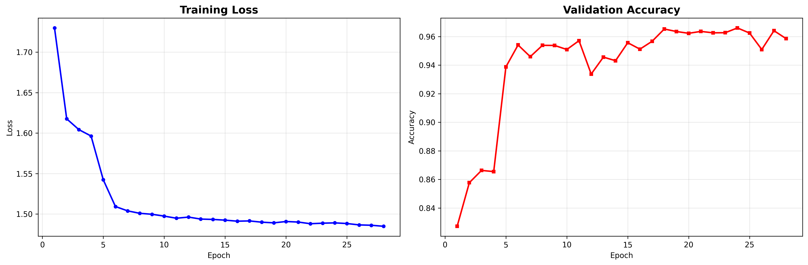
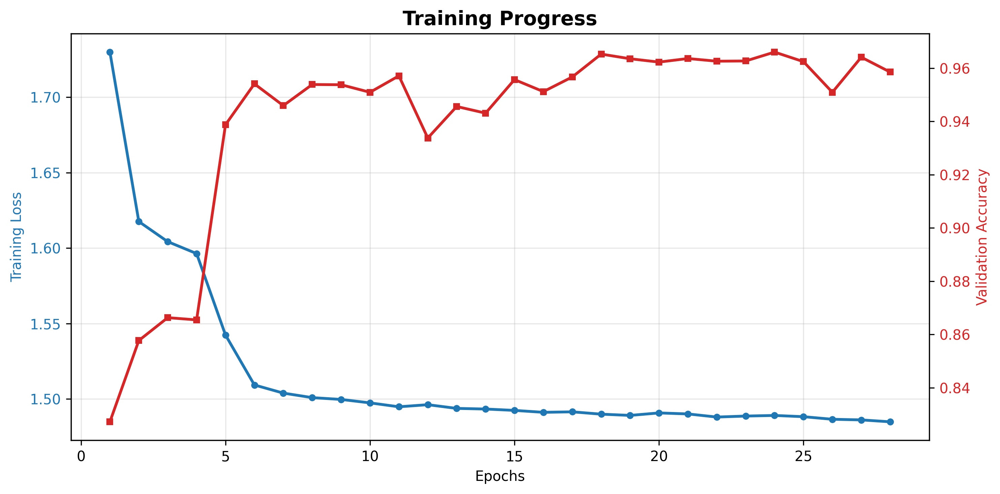
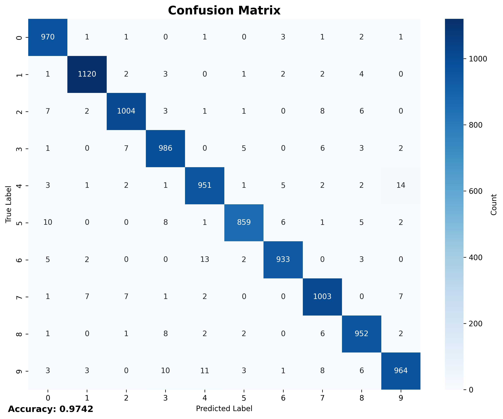
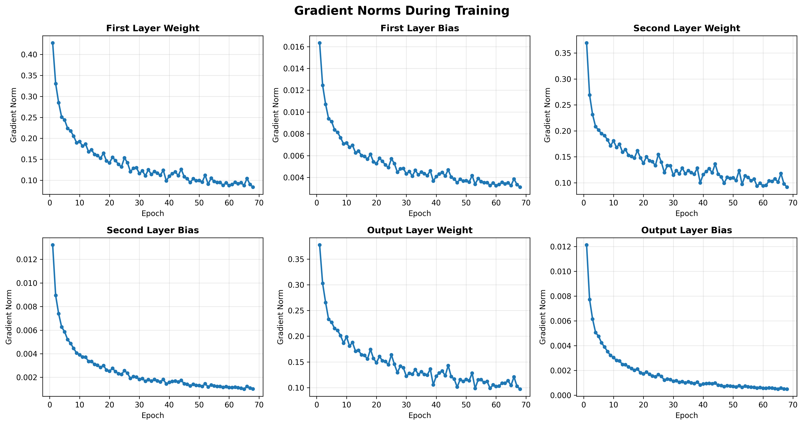
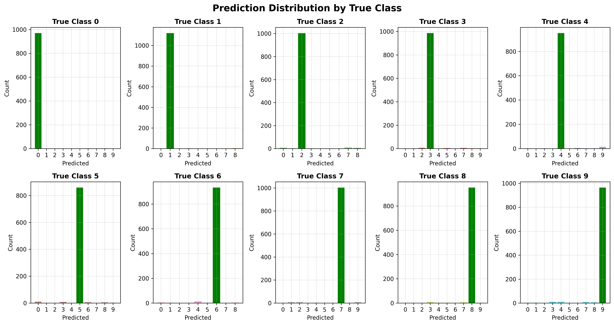
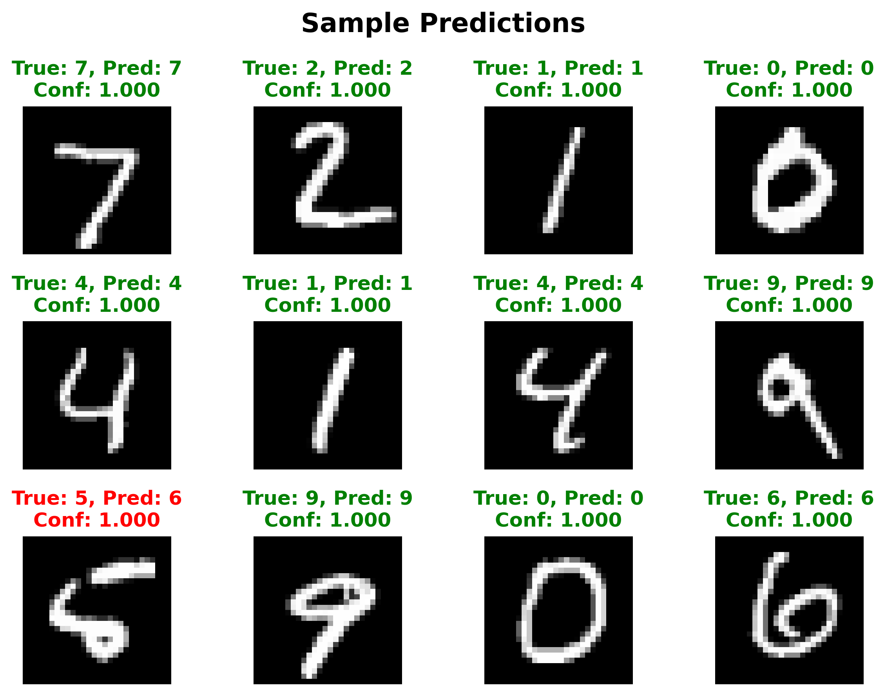

# MNIST Handwritten Digit Classification

A custom-built neural network implementation from scratch for handwritten digit classification using the MNIST dataset. This project features a complete deep learning pipeline with custom implementations of linear layers, activation functions, loss functions, and optimizers - all built without using PyTorch's high-level neural network modules.

## Table of Contents

-   [Project Overview](#project-overview)
-   [Key Features](#key-features)
-   [Model Architecture](#model-architecture)
-   [Dataset Information](#dataset-information)
-   [Installation](#installation)
-   [Usage](#usage)
-   [Training Results](#training-results)
-   [Technologies Used](#technologies-used)
-   [Contributing](#contributing)
-   [License](#license)

## Project Overview

This project implements a complete handwritten digit classification system using the MNIST dataset with a custom neural network built entirely from scratch. The implementation demonstrates a deep understanding of neural network fundamentals by manually implementing forward and backward propagation for all components.

## Key Features

-   **Custom Neural Network**: All components implemented from scratch including:
    -   Linear layers with manual forward/backward propagation
    -   ReLU and Softmax activation functions
    -   Cross-entropy loss function
    -   Adam optimizer
-   **High Accuracy**: Achieves **96.53%** validation accuracy on MNIST dataset
-   **Interactive GUI**: Real-time digit drawing and prediction using Tkinter
-   **Complete Training Pipeline**: Jupyter notebook with comprehensive training and visualization
-   **Model Checkpointing**: Automatic saving of best performing models during training
-   **Performance Visualization**: Training history, confusion matrix, and gradient analysis plots

## Model Architecture

### Network Architecture

The custom neural network consists of three fully connected layers:

```
Input (28x28 image) → Flatten (784) → Linear (784→256) → ReLU 
→ Linear (256→128) → ReLU → Linear (128→10) → Softmax → Output (10 classes)
```

### Layer Details

-   **Input Layer**: 784 neurons (28×28 flattened images)
-   **Hidden Layer 1**: 256 neurons with ReLU activation
-   **Hidden Layer 2**: 128 neurons with ReLU activation
-   **Output Layer**: 10 neurons with Softmax activation (digits 0-9)

### Custom Components Implementation

All components are implemented from scratch in `nn.py`:

1. **Linear Layer** (`Linear`):
   - Custom forward pass: `output = x @ W^T + b`
   - Custom backward pass: gradient computation for weights and biases
   - Xavier initialization for weights

2. **ReLU Activation** (`ReLU`):
   - Forward: `max(0, x)`
   - Backward: gradient masking

3. **Softmax Activation** (`Softmax`):
   - Numerically stable implementation
   - Forward and backward pass with cached outputs

4. **Cross-Entropy Loss** (`CrossEntropyLoss`):
   - Combined with Softmax for efficient computation
   - Custom gradient computation

5. **Adam Optimizer** (`Adam`):
   - First and second moment estimation
   - Bias correction
   - Adaptive learning rates per parameter

## Dataset Information

### MNIST Dataset

-   **Total Images**: 70,000 handwritten digits
-   **Image Size**: 28×28 pixels (grayscale)
-   **Classes**: 10 digits (0-9)
-   **Training Set**: 60,000 images
-   **Test Set**: 10,000 images
-   **Source**: Automatically downloaded via `torchvision.datasets`

### Data Preprocessing

-   **Normalization**: Pixel values normalized to range [-1, 1]
-   **Transformation Pipeline**:
  ```python
  transforms.Compose([
      transforms.Resize((28, 28)),
      transforms.ToTensor(),
      transforms.Normalize((0.5,), (0.5,))
  ])
  ```
-   **Batch Processing**: Batch size of 64 for training

## Installation

### Prerequisites

-   Python 3.7 or higher
-   pip package manager

### Step 1: Clone the Repository

```bash
git clone https://github.com/PhucHuwu/MNIST_Handwritten_classification.git
cd MNIST_Handwritten_classification
```

### Step 2: Install Dependencies

**For macOS:**
```bash
pip install -r requirements-mac.txt
```

**For other platforms:**
```bash
pip install -r requirements.txt
```

### Step 3: Verify Installation

```bash
python -c "import torch; print('PyTorch version:', torch.__version__)"
python -c "from nn import Net; print('Custom neural network loaded successfully')"
```

## Usage

### 1. Training the Model

Open and run the Jupyter notebook:

```bash
jupyter notebook train_model.ipynb
```

The notebook contains:
- Data loading and preprocessing
- Model initialization and training
- Validation and checkpointing
- Performance visualization and analysis

Training configuration:
- **Max Epochs**: 100
- **Early Stopping**: Patience of 10 epochs, min delta 0.0001
- **Batch Size**: 64
- **Optimizer**: Adam with learning rate 0.001

Training will automatically:
- Download the MNIST dataset
- Train for up to 100 epochs with early stopping
- Save the best models to `model_checkpoints/`
- Generate visualization plots in `training_plots/`

### 2. Testing with Interactive GUI

Run the Tkinter GUI application:

```bash
python test_mnist_tkinter.py
```

**How to use:**
1. Draw a digit on the black canvas using your mouse
2. The model will automatically predict the digit in real-time
3. View the predicted digit and confidence score
4. Click "Clear" to draw a new digit

**Note:** The GUI uses the best model checkpoint: `best_model_epoch_18_valacc_0.9653.pth`

### 3. Programmatic Testing

```python
from nn import Net
import torch
from torchvision import transforms
from PIL import Image

# Load the model
checkpoint = torch.load('model_checkpoints/best_model_epoch_18_valacc_0.9653.pth')
model = Net()

# Load model weights
model.first_layer.weight.data = checkpoint['model_state']['first_layer']['weight']
model.first_layer.bias.data = checkpoint['model_state']['first_layer']['bias']
model.second_layer.weight.data = checkpoint['model_state']['second_layer']['weight']
model.second_layer.bias.data = checkpoint['model_state']['second_layer']['bias']
model.output_layer.weight.data = checkpoint['model_state']['output_layer']['weight']
model.output_layer.bias.data = checkpoint['model_state']['output_layer']['bias']

# Prepare an image
transform = transforms.Compose([
    transforms.Resize((28, 28)),
    transforms.ToTensor(),
    transforms.Normalize((0.5,), (0.5,))
])

image = Image.open('your_digit.png').convert('L')
img_tensor = transform(image).unsqueeze(0)

# Make prediction
model.eval()
output = model.forward(img_tensor)
predicted = torch.argmax(output, dim=1).item()
confidence = torch.max(output).item()

print(f"Predicted digit: {predicted}")
print(f"Confidence: {confidence:.4f}")
```

## Training Results

### Performance Metrics

-   **Best Validation Accuracy**: **96.53%** (Epoch 18)
-   **Training Configuration**: Max 100 epochs with early stopping (patience: 10, min delta: 0.0001)
-   **Training Loss**: Converged smoothly
-   **Model Checkpoints**: 7 best models saved during training

### Model Checkpoints

| Checkpoint | Epoch | Validation Accuracy |
|-----------|-------|-------------------|
| best_model_epoch_1_valacc_0.8273.pth | 1 | 82.73% |
| best_model_epoch_2_valacc_0.8577.pth | 2 | 85.77% |
| best_model_epoch_3_valacc_0.8663.pth | 3 | 86.63% |
| best_model_epoch_5_valacc_0.9388.pth | 5 | 93.88% |
| best_model_epoch_6_valacc_0.9541.pth | 6 | 95.41% |
| best_model_epoch_11_valacc_0.9571.pth | 11 | 95.71% |
| **best_model_epoch_18_valacc_0.9653.pth** | **18** | **96.53%** |

### Training Visualizations

#### Training History

<p align="center">
  
</p>

The training history shows the progression of training loss and validation accuracy throughout the training process. The model demonstrates stable convergence with the validation accuracy steadily improving to reach 96.53%.

#### Combined Metrics Analysis

<p align="center">
  
</p>

This dual-axis plot illustrates the relationship between training loss (decreasing) and validation accuracy (increasing) throughout the training process, demonstrating effective learning without overfitting.

#### Confusion Matrix

<p align="center">
  
</p>

The confusion matrix shows per-class classification performance. The model achieves excellent accuracy across all digit classes (0-9), with most predictions concentrated along the diagonal, indicating correct classifications.

#### Gradient Norms Analysis

<p align="center">
  
</p>

Gradient norms throughout training indicate stable training dynamics. The gradients remain in a healthy range, confirming proper convergence without vanishing or exploding gradient problems.

#### Prediction Distribution

<p align="center">
  
</p>

This visualization shows the distribution of model predictions across different digit classes, demonstrating balanced performance and confidence levels.

#### Sample Predictions

<p align="center">
  
</p>

Visual examples of model predictions on test samples, showing both the input images and their predicted labels with confidence scores. This demonstrates the model's ability to correctly classify various handwriting styles.

## Technologies Used

### Core Technologies

-   **Python 3.7+** - Programming language
-   **PyTorch** - Tensor operations and automatic differentiation
-   **NumPy** - Numerical computing
-   **Tkinter** - GUI framework

### Libraries & Dependencies

```
torch==2.7.0 (or 2.2.2 for macOS)
torchvision==0.22.0 (or 0.17.2 for macOS)
numpy==1.26.4
matplotlib==3.10.1
seaborn==0.13.2
pandas==2.2.3
Pillow==11.1.0
tqdm==4.66.4
scikit-learn==1.6.1
```

### Custom Implementations

All neural network components are custom-built:
- **Linear layers** - Forward and backward propagation
- **Activation functions** - ReLU and Softmax
- **Loss function** - Cross-entropy loss
- **Optimizer** - Adam optimizer with momentum

## Contributing

Contributions are welcome! Here's how you can help:

1. **Fork the repository**
2. **Create a feature branch** (`git checkout -b feature/AmazingFeature`)
3. **Commit your changes** (`git commit -m 'Add some AmazingFeature'`)
4. **Push to the branch** (`git push origin feature/AmazingFeature`)
5. **Open a Pull Request**

### Areas for Contribution

- Improve model architecture
- Add more visualization options
- Implement additional optimizers
- Add support for other datasets
- Improve GUI features
- Add unit tests
- Enhance documentation

## License

This project is licensed under the MIT License - see the [LICENSE](LICENSE) file for details.

### Third-Party Licenses

- **PyTorch** - BSD License
- **MNIST Dataset** - Creative Commons Attribution-Share Alike 3.0 License

---

**Repository**: [github.com/PhucHuwu/MNIST_Handwritten_classification](https://github.com/PhucHuwu/MNIST_Handwritten_classification)

**Author**: PhucHuwu
