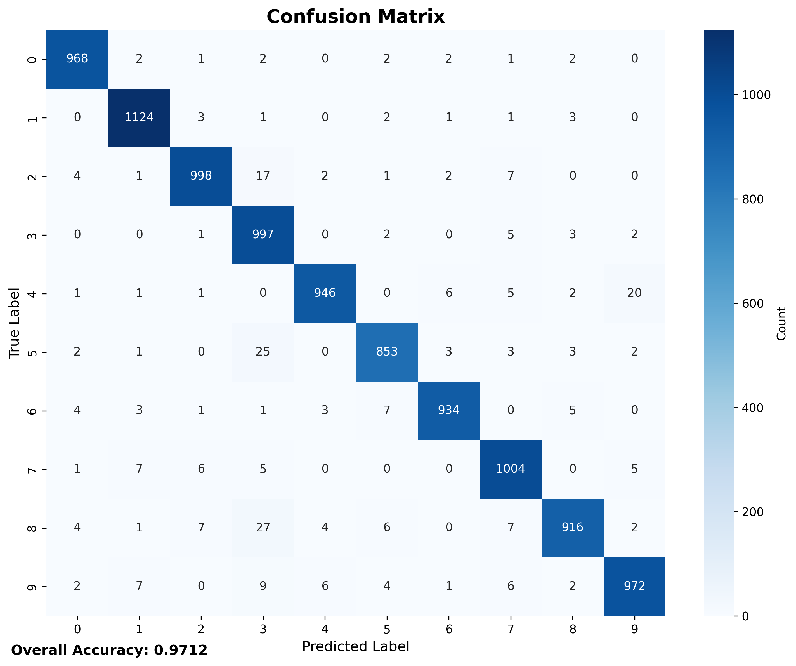

# MNIST Handwritten Digit Classification

## Table of Contents

-   [Project Overview](#project-overview)
-   [Project Structure](#project-structure)
-   [Dataset Information](#dataset-information)
-   [Model Architecture](#model-architecture)
-   [Training Configuration](#training-configuration)
-   [Performance Analysis](#performance-analysis)
-   [Technologies Used](#technologies-used)
-   [System Architecture](#system-architecture)
-   [Core Modules](#core-modules)
-   [Pipeline](#pipeline)
-   [Installation Guide](#installation-guide)
-   [Usage Guide](#usage-guide)
-   [Results and Performance](#results-and-performance)
-   [Troubleshooting](#troubleshooting)
-   [References](#references)
-   [Contributing](#contributing)
-   [License](#license)

## Project Overview

This project implements a complete handwritten digit classification system using the MNIST dataset with a custom neural network built from scratch. The system achieves high accuracy in digit recognition and includes an interactive GUI for real-time digit drawing and prediction.

### Key Features

-   **Custom Neural Network**: Complete implementation from scratch without relying on PyTorch's built-in layers
-   **High Accuracy**: Achieves 97.59% validation accuracy on MNIST dataset
-   **Interactive GUI**: Real-time digit drawing and prediction using Tkinter
-   **Comprehensive Training**: Complete training pipeline with visualization and analysis
-   **Model Checkpointing**: Automatic saving of best performing models
-   **Performance Analysis**: Detailed metrics and confusion matrix analysis

## Project Structure

```
MNIST_Handwritten_classification/
├── data/                          # MNIST dataset storage
│   └── MNIST/
│       └── raw/                   # Raw MNIST data files
│
├── model_checkpoints/             # Trained model checkpoints
│   ├── best_model_epoch_1_acc_x.xxxx.pth
│   └── [additional checkpoints...]
│
├── training_plots/                # Training visualization outputs
│   ├── confusion_matrix.png
│   ├── final_combined_metrics.png
│   ├── final_gradient_norms.png
│   ├── final_training_history.png
│   ├── prediction_distribution.png
│   └── sample_predictions.png
│
├── nn.py                          # Custom neural network implementation
├── test_mnist_tkinter.py          # Interactive GUI for digit testing
├── train_model.ipynb              # Complete training notebook
└── README.md                      # This documentation
```

## Dataset Information

### MNIST Dataset Overview

-   **Total Images**: 70,000 handwritten digits
-   **Image Size**: 28x28 pixels (grayscale)
-   **Classes**: 10 digits (0-9)
-   **Training Set**: 60,000 images
-   **Test Set**: 10,000 images
-   **Format**: Grayscale images with pixel values 0-255

### Data Distribution

| Dataset  | Number of Images | Percentage |
| -------- | ---------------- | ---------- |
| Training | 60,000           | 85.7%      |
| Test     | 10,000           | 14.3%      |

### Data Preprocessing

-   **Resize**: Images resized to 28x28 pixels
-   **Normalization**: Pixel values normalized to [-1, 1] range
-   **Tensor Conversion**: Images converted to PyTorch tensors
-   **Batch Processing**: Training with batch size of 64

## Model Architecture

### Custom Neural Network Implementation

The project features a complete neural network implementation from scratch:

```python
class Net:
    def __init__(self):
        self.flatten = Flatten()
        self.first_layer = Linear(784, 256)      # Input: 784, Hidden: 256
        self.first_activation = ReLU()
        self.second_layer = Linear(256, 128)     # Hidden: 256, Hidden: 128
        self.second_activation = ReLU()
        self.output_layer = Linear(128, 10)      # Hidden: 128, Output: 10
        self.output_activation = Softmax(dim=1)
```

### Layer Specifications

-   **Input Layer**: 784 neurons (28×28 flattened images)
-   **First Hidden Layer**: 256 neurons with ReLU activation
-   **Second Hidden Layer**: 128 neurons with ReLU activation
-   **Output Layer**: 10 neurons with Softmax activation (one per digit)

### Custom Implementations

-   **Linear Layer**: Complete forward and backward pass implementation
-   **ReLU Activation**: Custom ReLU implementation with gradient computation
-   **Softmax**: Softmax implementation with numerical stability
-   **Cross-Entropy Loss**: Custom loss function implementation
-   **Adam Optimizer**: Custom Adam optimizer implementation

## Training Configuration

### Training Parameters

-   **Epochs**: 30
-   **Batch Size**: 64
-   **Learning Rate**: 0.001
-   **Optimizer**: Adam (custom implementation)
-   **Loss Function**: Cross-Entropy Loss (custom implementation)
-   **Validation Split**: 10,000 test images

### Training Process

1. **Data Loading**: MNIST dataset downloaded and preprocessed
2. **Model Initialization**: Custom neural network with Xavier initialization
3. **Training Loop**: Forward pass, loss computation, backward pass, parameter updates
4. **Validation**: Accuracy evaluation on test set after each epoch
5. **Checkpointing**: Best model saved based on validation accuracy
6. **Visualization**: Training progress and performance metrics plotted

### Hardware Requirements

-   **CPU**: Any modern processor
-   **RAM**: Minimum 4GB (8GB recommended)
-   **Storage**: 1GB for dataset and models
-   **GPU**: Optional (CPU training supported)

## Performance Analysis

### Training Results

-   **Best Validation Accuracy**: 97.59% (Epoch 27)
-   **Final Validation Accuracy**: 97.12%
-   **Training Time**: ~6 minutes (357.54 seconds)
-   **Convergence**: Model converges around epoch 10-15

#### Training History Visualization


_Training loss and validation accuracy progression over 30 epochs. The model shows stable convergence with minimal overfitting._

#### Combined Metrics Analysis


_Dual-axis plot showing the relationship between training loss and validation accuracy throughout training._

### Per-Class Performance

| Digit | Accuracy | Samples |
| ----- | -------- | ------- |
| 0     | 98.78%   | 980     |
| 1     | 99.03%   | 1,135   |
| 2     | 96.71%   | 1,032   |
| 3     | 98.71%   | 1,010   |
| 4     | 96.33%   | 982     |
| 5     | 95.63%   | 892     |
| 6     | 97.49%   | 958     |
| 7     | 97.67%   | 1,028   |
| 8     | 94.05%   | 974     |
| 9     | 96.33%   | 1,009   |

### Overall Metrics

-   **Precision**: 97%
-   **Recall**: 97%
-   **F1-Score**: 97%
-   **Macro Average**: 97%
-   **Weighted Average**: 97%

#### Confusion Matrix Analysis



_Confusion matrix showing per-class classification performance. The model demonstrates excellent accuracy across all digit classes._

#### Gradient Norms Analysis


_Gradient norms throughout training, indicating stable training dynamics and proper convergence._

#### Prediction Distribution


_Distribution of model predictions showing confidence levels and prediction patterns across different digit classes._

## Technologies Used

### Core Technologies

-   **Python**: Primary programming language
-   **PyTorch**: Deep learning framework for tensor operations
-   **NumPy**: Numerical computing
-   **Matplotlib**: Data visualization
-   **Seaborn**: Statistical data visualization
-   **Tkinter**: GUI framework for interactive testing

### Libraries & Dependencies

-   **torch**: PyTorch core library
-   **torchvision**: Computer vision tools for PyTorch
-   **torchvision.transforms**: Image transformations
-   **PIL (Pillow)**: Image processing
-   **matplotlib.pyplot**: Plotting and visualization
-   **seaborn**: Statistical visualization
-   **numpy**: Numerical operations
-   **sklearn.metrics**: Performance metrics
-   **tqdm**: Progress bars
-   **pandas**: Data manipulation

## System Architecture

### 1. Data Pipeline

```
Raw MNIST Images → Preprocessing → Tensor Conversion → Batch Loading
```

### 2. Training Pipeline

```
Dataset → Custom Neural Network → Forward Pass → Loss Computation → Backward Pass → Parameter Updates
```

### 3. Inference Pipeline

```
Input Image → Preprocessing → Model Forward Pass → Softmax → Prediction
```

### 4. GUI Pipeline

```
User Drawing → Image Processing → Model Prediction → Result Display
```

## Core Modules

### 1. Neural Network Module (`nn.py`)

-   **Linear Layer**: Fully connected layer with custom forward/backward
-   **ReLU Activation**: Rectified Linear Unit implementation
-   **Softmax**: Softmax activation with numerical stability
-   **Flatten**: Tensor flattening operation
-   **Cross-Entropy Loss**: Custom loss function
-   **Adam Optimizer**: Custom optimizer implementation
-   **Sequential**: Layer composition utility

### 2. Training Module (`train_model.ipynb`)

-   **Data Loading**: MNIST dataset preparation
-   **Training Loop**: Complete training process
-   **Validation**: Model evaluation
-   **Checkpointing**: Model saving and loading
-   **Visualization**: Training progress plots
-   **Metrics**: Performance analysis

### 3. Testing Module (`test_mnist_tkinter.py`)

-   **Model Loading**: Checkpoint restoration
-   **GUI Interface**: Interactive drawing canvas
-   **Real-time Prediction**: Live digit recognition
-   **Image Processing**: Drawing to tensor conversion

### 4. Visualization Module

-   **Training History**: Loss and accuracy plots
-   **Confusion Matrix**: Classification performance
-   **Gradient Analysis**: Training stability
-   **Sample Predictions**: Visual model outputs

## Pipeline

### Training Pipeline

```
1. Data Preparation
   ├── Download MNIST dataset
   ├── Apply transformations
   └── Create data loaders

2. Model Training
   ├── Initialize custom neural network
   ├── Set up optimizer and loss function
   ├── Training loop (30 epochs)
   ├── Validation after each epoch
   └── Save best model checkpoints

3. Model Evaluation
   ├── Load best model
   ├── Evaluate on test set
   ├── Generate confusion matrix
   └── Create performance visualizations
```

### Inference Pipeline

```
1. Input Processing
   ├── Load and preprocess image
   ├── Apply transformations
   └── Convert to tensor format

2. Model Inference
   ├── Forward pass through network
   ├── Apply softmax activation
   └── Get prediction probabilities

3. Output Generation
   ├── Extract predicted class
   ├── Calculate confidence score
   └── Return results
```

### GUI Pipeline

```
1. User Interaction
   ├── Draw digit on canvas
   ├── Process drawing events
   └── Capture drawing data

2. Image Processing
   ├── Convert canvas to PIL image
   ├── Resize to 28x28 pixels
   └── Apply preprocessing

3. Prediction Display
   ├── Run model inference
   ├── Display predicted digit
   └── Show confidence score
```

## Installation Guide

### System Requirements

-   **Python**: 3.7+
-   **RAM**: Minimum 4GB (8GB recommended)
-   **Storage**: 1GB free space
-   **OS**: Windows, macOS, or Linux

### Step 1: Clone Repository

```bash
git clone https://github.com/yourusername/MNIST_Handwritten_classification.git
cd MNIST_Handwritten_classification
```

### Step 2: Install Dependencies

```bash
# Install required packages
pip install torch torchvision
pip install matplotlib seaborn numpy pandas
pip install pillow tqdm scikit-learn
```

### Step 3: Verify Installation

```bash
# Test PyTorch installation
python -c "import torch; print(f'PyTorch version: {torch.__version__}')"

# Test custom neural network
python -c "from nn import Net; print('Custom neural network ready')"
```

## Usage Guide

### 1. Training the Model

#### Basic Training

```python
# Run the training notebook
jupyter notebook train_model.ipynb

# Or execute cells in order:
# 1. Import libraries and define functions
# 2. Load and preprocess MNIST dataset
# 3. Initialize model and start training
# 4. Monitor training progress
# 5. Evaluate final model performance
```

#### Training Parameters

-   **Epochs**: Adjust `num_epochs` variable (default: 30)
-   **Batch Size**: Modify `batch_size` in DataLoader (default: 64)
-   **Learning Rate**: Change `lr` in Adam optimizer (default: 0.001)
-   **Model Architecture**: Modify layer sizes in `Net` class

### 2. Testing the Model

#### Interactive GUI Testing

```bash
# Run the interactive testing application
python test_mnist_tkinter.py
```

#### Programmatic Testing

```python
from nn import Net
import torch
import torchvision.transforms as transforms
from PIL import Image

# Load trained model
checkpoint = torch.load('model_checkpoints/best_model_epoch_27_acc_0.9759.pth')
model = Net()
# Load checkpoint weights...

# Test on single image
image = Image.open('test_digit.png').convert('L')
transform = transforms.Compose([
    transforms.Resize((28, 28)),
    transforms.ToTensor(),
    transforms.Normalize((0.5,), (0.5,))
])
tensor = transform(image).unsqueeze(0)

# Get prediction
model.eval()
output = model.forward(tensor)
predicted = torch.argmax(output, dim=1).item()
confidence = torch.max(output, dim=1).values.item()
print(f"Predicted: {predicted}, Confidence: {confidence:.3f}")
```

### 3. Complete Workflow

#### Step 1: Training

```bash
# Open and run the training notebook
jupyter notebook train_model.ipynb
```

#### Step 2: Model Evaluation

```python
# The notebook automatically generates:
# - Training history plots
# - Confusion matrix
# - Performance metrics
# - Sample predictions
```

#### Step 3: Interactive Testing

```bash
# Launch the GUI application
python test_mnist_tkinter.py
```

## Results and Performance

### Training Metrics

-   **Best Validation Accuracy**: 97.59%
-   **Training Convergence**: Achieved by epoch 27
-   **Model Stability**: Consistent performance across epochs
-   **Overfitting Prevention**: Good generalization to test set

### Visualization Outputs

The training process generates comprehensive visualizations:

-   **Training History**: Loss and accuracy progression
-   **Combined Metrics**: Dual-axis plot of loss vs accuracy
-   **Confusion Matrix**: Per-class classification performance
-   **Gradient Norms**: Training stability analysis
-   **Prediction Distribution**: Model confidence analysis
-   **Sample Predictions**: Visual examples of model outputs

#### Sample Predictions Visualization


_Visual examples of model predictions on test samples, showing both correct and incorrect classifications with confidence scores._

### Model Checkpoints

Multiple checkpoints are saved during training:

-   **best_model_epoch_1_acc_0.9371.pth**: Early training checkpoint
-   **best_model_epoch_10_acc_0.9671.pth**: Mid-training checkpoint
-   **best_model_epoch_27_acc_0.9759.pth**: Best performing model

## Troubleshooting

### Common Issues

#### 1. CUDA/GPU Issues

```bash
# Force CPU usage if GPU not available
import torch
torch.set_default_tensor_type('torch.FloatTensor')
```

#### 2. Memory Issues

```python
# Reduce batch size
training_loader = torch.utils.data.DataLoader(
    training_set,
    batch_size=32,  # Reduced from 64
    shuffle=True
)
```

#### 3. Model Loading Issues

```python
# Ensure correct checkpoint path
checkpoint_path = 'model_checkpoints/best_model_epoch_27_acc_0.9759.pth'
if not os.path.exists(checkpoint_path):
    print("Checkpoint not found. Please train the model first.")
```

#### 4. GUI Issues

```bash
# Install tkinter if missing
# Ubuntu/Debian:
sudo apt-get install python3-tk

# macOS:
brew install python-tk

# Windows:
# Usually included with Python installation
```

### Performance Optimization Tips

-   **Batch Size**: Adjust based on available memory
-   **Learning Rate**: Reduce for more stable training
-   **Epochs**: Increase for potentially better accuracy
-   **Model Size**: Modify layer dimensions for different complexity

## References

### Official Documentation

-   [PyTorch Documentation](https://pytorch.org/docs/)
-   [MNIST Dataset](http://yann.lecun.com/exdb/mnist/)
-   [Torchvision Documentation](https://pytorch.org/vision/)

### Research Papers

-   **MNIST Paper**: "Gradient-Based Learning Applied to Document Recognition" by Yann LeCun
-   **Neural Networks**: "Deep Learning" by Ian Goodfellow, Yoshua Bengio, Aaron Courville

### Tutorials & Guides

-   [PyTorch Tutorials](https://pytorch.org/tutorials/)
-   [Neural Network Implementation](https://pytorch.org/tutorials/beginner/pytorch_with_examples.html)
-   [MNIST Classification Guide](https://pytorch.org/tutorials/beginner/blitz/cifar10_tutorial.html)

### Related Projects

-   [PyTorch MNIST Example](https://github.com/pytorch/examples/tree/master/mnist)
-   [Neural Network from Scratch](https://github.com/eriklindernoren/ML-From-Scratch)
-   [Interactive MNIST](https://github.com/ashishpatel26/Interactive-MNIST)

### Community Resources

-   [PyTorch Forums](https://discuss.pytorch.org/)
-   [Stack Overflow PyTorch](https://stackoverflow.com/questions/tagged/pytorch)
-   [Reddit r/MachineLearning](https://www.reddit.com/r/MachineLearning/)

## Contributing

This project is developed for educational and research purposes. Contributions are welcome:

-   **Bug Reports**: Report issues and bugs
-   **Feature Requests**: Suggest new features and improvements
-   **Code Improvements**: Optimize existing implementations
-   **Documentation**: Enhance documentation and examples
-   **Testing**: Add comprehensive test cases

### Contribution Guidelines

1. Fork the repository
2. Create a feature branch
3. Make your changes
4. Add tests if applicable
5. Update documentation
6. Submit a pull request

## License

This project is developed for educational and research purposes. Please respect the licenses of the libraries and frameworks used:

-   **PyTorch**: BSD License
-   **MNIST Dataset**: Creative Commons Attribution-Share Alike 3.0 License
-   **Other Dependencies**: Respective open-source licenses

For commercial use, please ensure compliance with all applicable licenses and terms of use.
